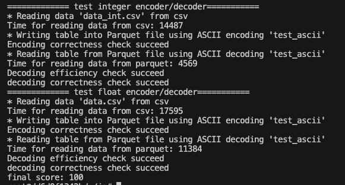

# CS 598 MP2: ASCII Encoder for Apache Arrow

CS 598 YP Spring 2024\
**Last Updated:** Feburuary 26th 2024\
**Deadline:** March 26th 2024

In this project, you will be changing the apache arrow source code and implementing a new Parquet encoder: ASCII Encoder, for Integer and Float data types.

Before starting, you should learn the basic idea of apache arrow, apache parquet format by following the links below:

[Understand Arrow](https://arrow.apache.org/overview/)

[What is parquet](https://parquet.apache.org/docs/concepts/)

[Difference between Arrow and Parquet](https://arrow.apache.org/faq/#:~:text=Arrow%20data%20is%20not%20compressed,commonly%20used%20together%20in%20applications).

## Getting Started
## Step 1: Set up git repository
Just as MP1, to get started, you will need to [clone](https://docs.github.com/en/repositories/creating-and-managing-repositories/cloning-a-repository) this repository to your own Github account - please do not commit directly to this repository!
You will then need to make your cloned repository **private**. 

## Step 2: Set up docker
Enter the directory of this readme file. Then, you can run the grading project who's using apache arrow using Docker Compose. Note that the docker mounts two volumes inside the Docker image:
* `/arrow` points to the Arrow source tree
* `/io` points to this cs598/ascii directory

```bash
docker-compose run debug #spin up docker in debug mode
cd io/
./run.sh #build arrow, build test and run
```
or if you have already created a docker container before, you can reenter it by:

```bash
docker ps -a # to check the id of all the containers; then you can find the corresponding container id for the previous container
docker start "your container id"
docker exec -it "your container id" bash
```
After entering the bash, you can `cd io/` and `./run.sh` again.


After running [`run.sh`](https://github.com/illinoisdata/CS598-MP2-Apache-Arrow/blob/32af9b1cc85d249ec2ee181d459d232ffa7ba414/cpp/cs598/ascii/run.sh) You will see errors because the functions are not been implemented yet. 


## Your tasks
In this project, you will be changing the apache arrow source code and implementing a new Parquet encoder: ASCII Encoder, for Integer and Float data type.

### Task 1: Implement ASCII encoder and decoder for the Integer type
To do this, you'll need to fill the [`int ASCIIDecoder<DType>::Decode(T* buffer, int max_vfalues)`](https://github.com/illinoisdata/CS598-MP2-Apache-Arrow/blob/32af9b1cc85d249ec2ee181d459d232ffa7ba414/cpp/src/parquet/encoding.cc#L3180) and [`void ASCIIEncoder<DType>::Put(const T* buffer, int num_values)`](https://github.com/illinoisdata/CS598-MP2-Apache-Arrow/blob/32af9b1cc85d249ec2ee181d459d232ffa7ba414/cpp/src/parquet/encoding.cc#L3133) function in [`src/parquet/encoding.cc`](https://github.com/illinoisdata/CS598-MP2-Apache-Arrow/blob/32af9b1cc85d249ec2ee181d459d232ffa7ba414/cpp/src/parquet/encoding.cc#L3133) file.

The ascii encoder will encode integer to ascii code. e.g., for integer 96, the encoder should encode it as '9''6''\000', with '\000' marks the end of a string.

Ways to quickly get started: 
1. Observe the corresponding functions in PlainEncoder and understand what they are doing. The TA has already added some comment for [PlainEncoder](https://github.com/illinoisdata/CS598-MP2-Apache-Arrow/blob/e143d55496529e9541b1ca8f9826185bb0c1e470/cpp/src/parquet/encoding.cc#L178) and [PlainDecoder](https://github.com/illinoisdata/CS598-MP2-Apache-Arrow/blob/e143d55496529e9541b1ca8f9826185bb0c1e470/cpp/src/parquet/encoding.cc#L1107).
2. Using debugger tools like GDB to trace what's happening. (To start gdb, in io/ directory of the container, run gdb /build/example/arrow-example)

After finishing task 1, you should be able to execute run.sh in /io and get 50% score.

### Task 2: Further implement ASCII encoder and decoder for Float type
Polish your [`int ASCIIDecoder<DType>::Decode(T* buffer, int max_vfalues)`](https://github.com/illinoisdata/CS598-MP2-Apache-Arrow/blob/32af9b1cc85d249ec2ee181d459d232ffa7ba414/cpp/src/parquet/encoding.cc#L3180) and [`void ASCIIEncoder<DType>::Put(const T* buffer, int num_values)`](https://github.com/illinoisdata/CS598-MP2-Apache-Arrow/blob/32af9b1cc85d249ec2ee181d459d232ffa7ba414/cpp/src/parquet/encoding.cc#L3133) functions to further support float encoding and decoding. 

The ASCII representation of float should keep two decimal places. e.g., For float 32.5887, the encoder should encode it as '3''2''.''5''9''\000'. 

Except changing those two functions, you should also uncomment [this place](https://github.com/illinoisdata/CS598-MP2-Apache-Arrow/blob/e143d55496529e9541b1ca8f9826185bb0c1e470/cpp/src/parquet/encoding.cc#L3906) and [this place](https://github.com/illinoisdata/CS598-MP2-Apache-Arrow/blob/e143d55496529e9541b1ca8f9826185bb0c1e470/cpp/src/parquet/encoding.cc#L3990) in encoding.cc for the float encoding to run.
 

After finishing task 2, you should be able to execute run.sh in /io and get all the 100% score. (See Running the test project for detail)



## This directory

This directory showcases an already written build script of Arrow C++ (in `build_arrow.sh`).
This build is then used by an third-party C++ testing project
using CMake logic to compile and link against the Arrow C++ library
(in `build_example.sh` and `CMakeLists.txt`). If you are interested in how to build arrow yourself, you can visit [build apache arrow cpp](https://arrow.apache.org/docs/dev/developers/cpp/building.html#building-arrow-cpp)

It also includes the docker configurations (in `docker-compose.yml` and `minimal.dockerfile`), because all the experiments are expected to be done in docker container. To learn more about docker and docker-compose, visit 
- [docker](https://docker-curriculum.com/)
- [docker-compose](https://docs.docker.com/compose/)

When running, the test executable reads files named 'data_int.csv' and 'data.csv' respectively, saves them in Parquet Format using your encoder and then read the arrow table back from the parquet files using your decoder. 


## Grading
The grade is given automatically by github workflow. You can check .github/grade.yml file for detail. For decoders, the reading + decoding efficiency must be better than the built-in csv reader. The final grade is devided into four parts, with each weights 25%:

- Integer Encoder: 25%
- Integer Decoder: 25% (20% correctness + 5% efficiency)
- Float Encoder: 25%
- Float Decoder: 25% (20% correctness + 5% efficiency)

Attention: Please Do not change anything of the testing file (test.cc, checker.cc and checker.h) and data files(data_int.csv and data.csv), we will use git diff to make sure it's untouched. If you changed it for debugging, please revert it before submitting your solution! 

You can check your final score after pushing your code to main on github action.
 

If you cannot see it, please make sure you've enabled workflow on github.

## Submission instructions

You will submit your work for Project 2 by uploading the URL of your private repository to the Project 2 - Apache Arrow assignment to Canvas. You will also need to share access to your private repository to the two course TAs:
- Billy Li (BillyZhaohengLi)
- Hanxi Fang (iq180fq200)


