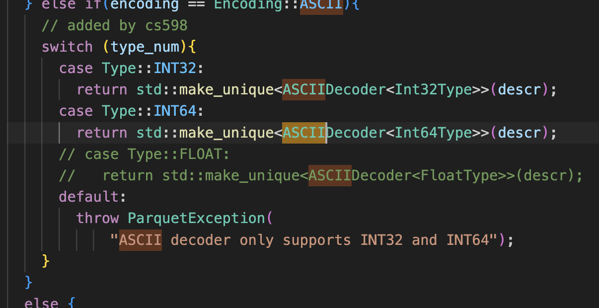
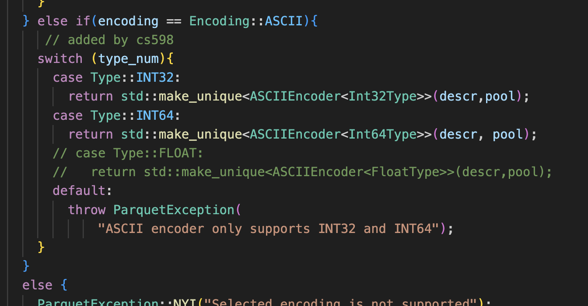
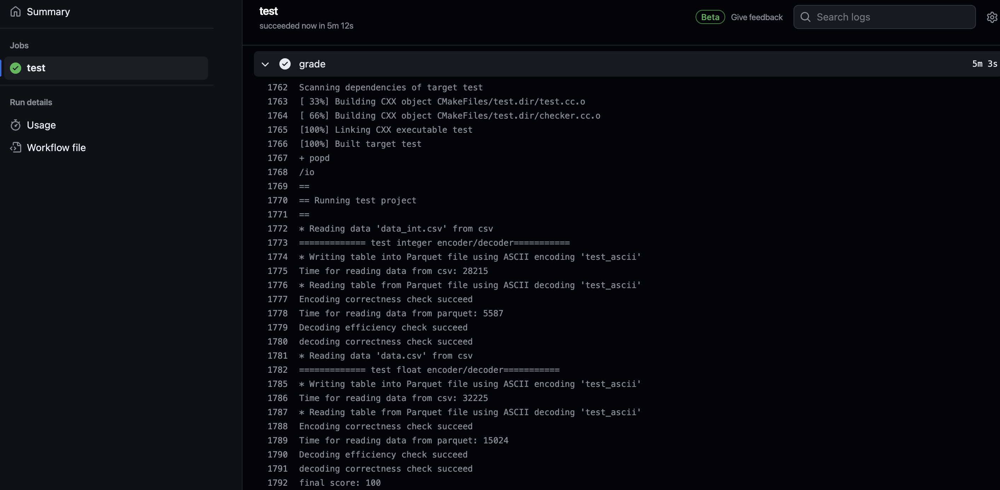

# CS 598 MP2: ASCII Encoder for Apache Arrow

CS 598 YP Spring 2024\
**Last Updated:** Feburuary 26th 2024\
**Deadline:** March 26th 2024

## Project Overview

In this project, you will be modifying the Apache Arrow source code to implement a new **ASCII Encoder and Decoder**. Your Encoder and Decoder will be used for writing/reading Arrow Dataframes to/from Parquet files and should support the Integer and Float data types.

This project will require a basic understanding of Apache Arrow and the Apache Parquet format. A brief overview can be found in the links below:

[Understanding Arrow](https://arrow.apache.org/overview/)

[What is Parquet?](https://parquet.apache.org/docs/concepts/)

[Difference between Arrow and Parquet](https://arrow.apache.org/faq/#:~:text=Arrow%20data%20is%20not%20compressed,commonly%20used%20together%20in%20applications).

## Getting Started
### Step 1: Seting up Your Github Repository
Similar to MP1, you will need to [clone](https://docs.github.com/en/repositories/creating-and-managing-repositories/cloning-a-repository) this repository to your own Github account to get started - please do not commit directly to this repository!
You will then need to make your cloned repository **private**. 

### Step 2: Setting up Docker
Enter the directory of this README file:

```bash
cd cpp/cs598/ascii
```

Then, you can run the grader using `docker-compose`. Note that the docker mounts two volumes inside the Docker image:
* `/arrow` points to the Arrow source tree
* `/io` points to this directory (i.e., `cpp/cs598/ascii`)

```bash
docker-compose run debug #spin up docker in debug mode
cd io/
./run.sh #build arrow, build test and run
```
or if you have already created a docker container before, you can reenter it and run the grader as follows:

```bash
docker ps -a # to check the id of all the containers; then you can find the corresponding container id for the previous container
docker start "your container id"
docker exec -it "your container id" bash
cd io/
./run.sh
```

Running [`run.sh`](https://github.com/illinoisdata/CS598-MP2-Apache-Arrow/blob/32af9b1cc85d249ec2ee181d459d232ffa7ba414/cpp/cs598/ascii/run.sh) now will result in errors as the ASCII encoding and decoding functions are not implemented yet. 


## Tasks
Your task is to modify the Apache Arrow source code to implement a new ASCII Encoder and Decoder for Parquet, supporting the Integer and Float data types.

### Task 1: Implement ASCII Encoder and Decoder for the Integer Type
You will need to implement the ASCII Encoding and Decoding functions for the `int32` and `int64` datatypes found in [`src/parquet/encoding.cc`](https://github.com/illinoisdata/CS598-MP2-Apache-Arrow/blob/32af9b1cc85d249ec2ee181d459d232ffa7ba414/cpp/src/parquet/encoding.cc#L3133) - [`int ASCIIDecoder<DType>::Decode(T* buffer, int max_vfalues)`](https://github.com/illinoisdata/CS598-MP2-Apache-Arrow/blob/32af9b1cc85d249ec2ee181d459d232ffa7ba414/cpp/src/parquet/encoding.cc#L3180) and [`void ASCIIEncoder<DType>::Put(const T* buffer, int num_values)`](https://github.com/illinoisdata/CS598-MP2-Apache-Arrow/blob/32af9b1cc85d249ec2ee181d459d232ffa7ba414/cpp/src/parquet/encoding.cc#L3133).
* The **encoder function** will encode integers to ASCII representations: e.g., the integer `96` is encoded as `'9''6''\000'`, where `'\000'` is a zero byte marking the end of a string.
* The **decoder function** will decode ASCII representations back into integers: e.g., `'9''6''\000'` is decoded back into the integer `96`.

Hints to get started: 
1. Observe the corresponding functions in the **PlainEncoder** and **PlainDecoder** which [encodes and decods values back to back](https://parquet.apache.org/docs/file-format/data-pages/encodings). The TA has provided some comments as hints to aid your understanding in [PlainEncoder](https://github.com/illinoisdata/CS598-MP2-Apache-Arrow/blob/e143d55496529e9541b1ca8f9826185bb0c1e470/cpp/src/parquet/encoding.cc#L178) and [PlainDecoder](https://github.com/illinoisdata/CS598-MP2-Apache-Arrow/blob/e143d55496529e9541b1ca8f9826185bb0c1e470/cpp/src/parquet/encoding.cc#L1107).
2. Using debugging tools such as GDB to trace the control flow. GDB can be run as follows from the container:

```
cd io/  # Make sure you are in the container
gdb /build/example/arrow-example
```

After finishing task 1, executing `run.sh` in `/io` should display a score of 50%.

### Task 2: Extending the ASCII Encoder and Decoder to Support the Float Type
Your second task is to extend your implementations of [`int ASCIIDecoder<DType>::Decode(T* buffer, int max_vfalues)`](https://github.com/illinoisdata/CS598-MP2-Apache-Arrow/blob/32af9b1cc85d249ec2ee181d459d232ffa7ba414/cpp/src/parquet/encoding.cc#L3180) and [`void ASCIIEncoder<DType>::Put(const T* buffer, int num_values)`](https://github.com/illinoisdata/CS598-MP2-Apache-Arrow/blob/32af9b1cc85d249ec2ee181d459d232ffa7ba414/cpp/src/parquet/encoding.cc#L3133) functions to support encoding and decoding floats.

When encoding floats as ASCII representation, round to **two decimal places**: e.g., The float 32.5887 is encoded as '3''2''.''5''9''\000'. 

After extending the two functions to support floats, you should also uncomment [this code snippet](https://github.com/illinoisdata/CS598-MP2-Apache-Arrow/blob/e143d55496529e9541b1ca8f9826185bb0c1e470/cpp/src/parquet/encoding.cc#L3906) and [this code snippet](https://github.com/illinoisdata/CS598-MP2-Apache-Arrow/blob/e143d55496529e9541b1ca8f9826185bb0c1e470/cpp/src/parquet/encoding.cc#L3990) in `encoding.cc` for the float encoding to run.
 

After finishing task 2, executing `run.sh` in `/io` should display a full score of 100%.


## Grading
You will be evaluated on the correctness and efficiency of your implementations via the **Github Action workflow** found [here](https://github.com/illinoisdata/CS598-MP2-Apache-Arrow/blob/main/.github/workflows/grade.yml). Efficiency-wise, the reading + decoding efficiency of your decoder must be better than the built-in CSV reader. The final grade is divided as follows:

- Integer Encoder: 25%
- Integer Decoder: 25% (20% correctness + 5% efficiency)
- Float Encoder: 25%
- Float Decoder: 25% (20% correctness + 5% efficiency)

**Note**: Please ensure that the testing files (`test.cc`, `checker.cc` and `checker.h`) and data files(`data_int.csv` and `data.csv`) are unmodified in your submission. If you modified them during debugging, please remember to revert them before submission.

You can check your final score after pushing your code to `main` in Github Actions:
 

If Github Actions is missing, please make sure that you have enabled workflows in your repository.

## Submission instructions

You will submit your work for Project 2 by uploading the URL of your private repository to the Project 2 - Apache Arrow assignment to Canvas. You will also need to share access to your private repository to the two course TAs:
- Billy Li (BillyZhaohengLi)
- Hanxi Fang (iq180fq200)

## FYI

This directory contains a build script for Arrow C++ (in `build_arrow.sh`). The build is used by a third-party C++ testing project which is compiled and linked to the Arrow C++ library using CMake (in `build_example.sh` and `CMakeLists.txt`). 
* Check out [build apache arrow cpp](https://arrow.apache.org/docs/dev/developers/cpp/building.html#building-arrow-cpp) if you are interested in building Arrow yourself.

It also includes the docker configurations (in `docker-compose.yml` and `minimal.dockerfile`) as we expect all experiments to be run in the docker container. To learn more about docker and docker-compose, visit
- [docker](https://docker-curriculum.com/)
- [docker-compose](https://docs.docker.com/compose/)

The test script grades your submission by reading the `data_int.csv` and `data.csv` files, saving them in Parquet Format using your encoder, then reading the Parquet files using your decoder back into Arrow tables.


